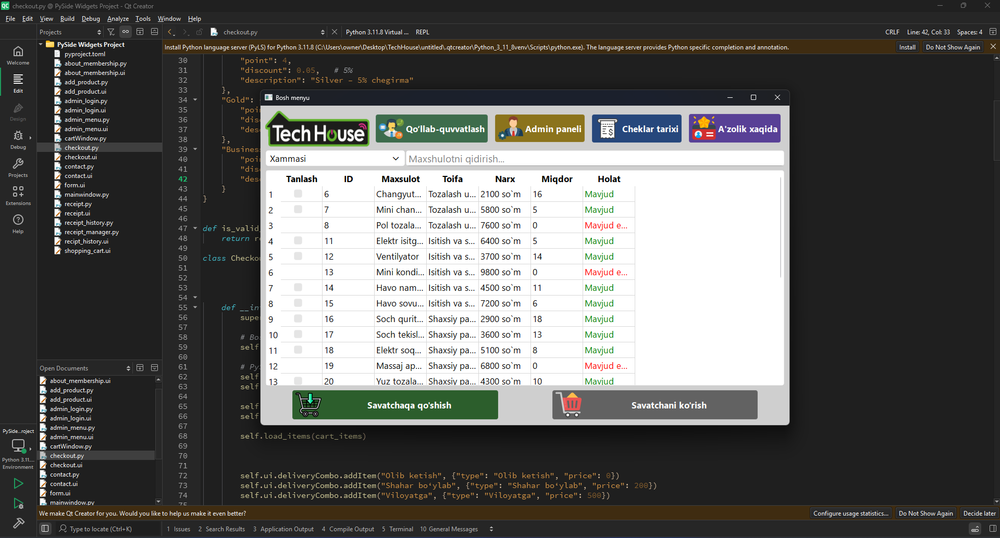
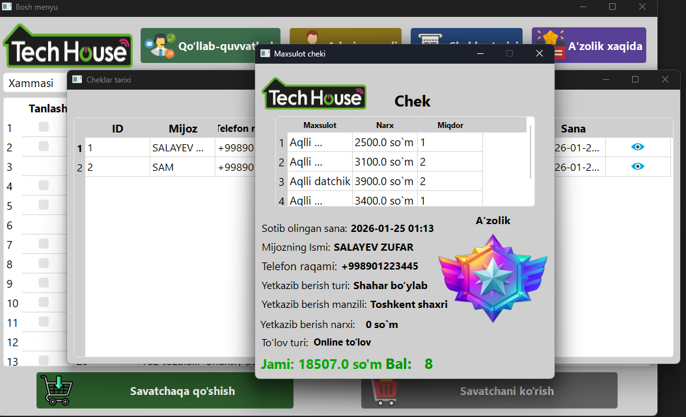
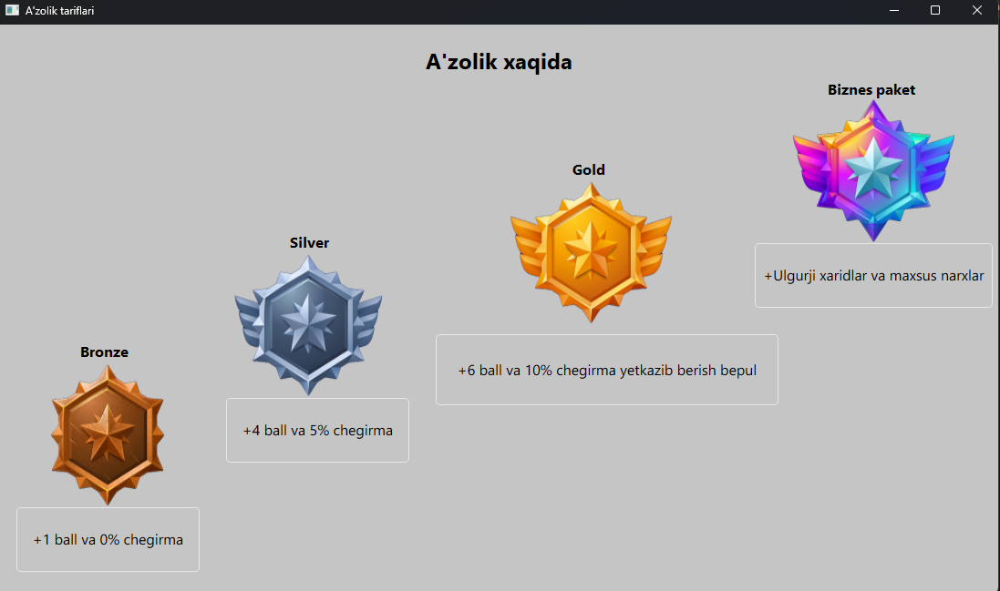
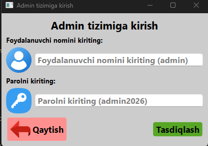
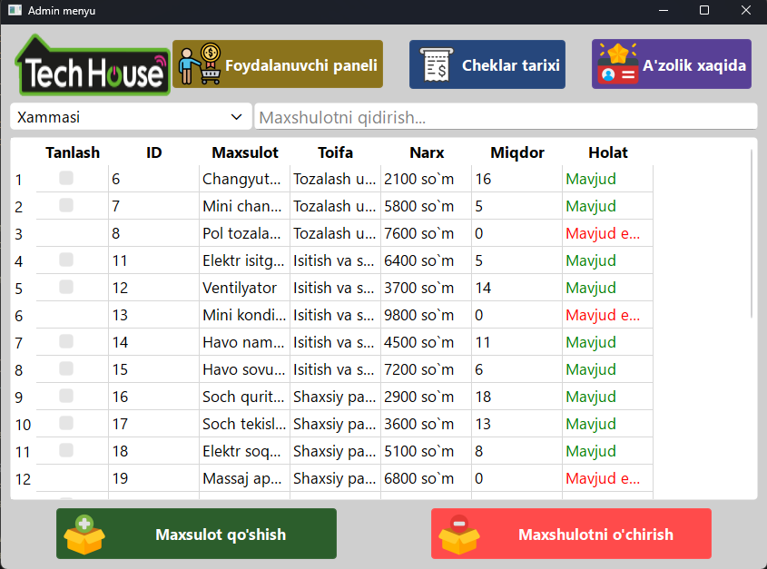

# 🚀 Tech House Management System (PyQt Project)


---

## 📷 Screenshots
> Screenshots can be found in the `screenshots/` folder and are displayed here:






---


## 📌 Project Overview
This project is a **desktop application developed in Python using the PyQt framework**.  
The main goal of the project is to demonstrate **Object-Oriented Programming (OOP)** principles and create a **real-world usable system** with a graphical user interface.

🧑‍💻 This project was created as part of my **BTEC final assessment**, and all requirements were fully met.

---

## 🛠️ Technologies Used
- 🐍 **Python**
- 🖼️ **PyQt (GUI framework)**
- 🧱 **Object-Oriented Programming (OOP)**
- 🗂️ **Git & GitHub** (Version Control)

---

## ✨ Key Features
✅ User-friendly graphical interface  
✅ OOP-based architecture  
✅ Real-time interaction via GUI  
✅ Modular and scalable design  

---

## 🧠 OOP Concepts Used
This project demonstrates the following **OOP principles**:

### 🔒 Encapsulation
- Private attributes are protected using getters and setters.
- Data is safely managed inside classes.

### 🧬 Inheritance
- Child classes inherit properties and methods from parent classes.
- Code reusability is improved.

### 🔁 Polymorphism
- Methods with the same name behave differently depending on the object.

### 🧩 Abstraction
- Only necessary functionality is exposed to the user.

---

## 🖥️ Application Interface
The application interface is built using **PyQt**, providing:
- Buttons, inputs, and labels
- Event handling (clicks, actions)
- Responsive and clean UI design

## ▶️ How to Run the Project
1. Make sure **Python** is installed
2. Install required library:
```bash
pip install pyqt5

```
3. Run the application:
```bash
python mainwindow.py

```
